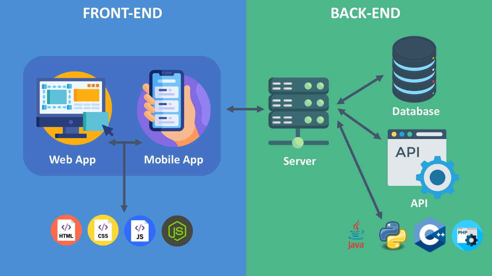
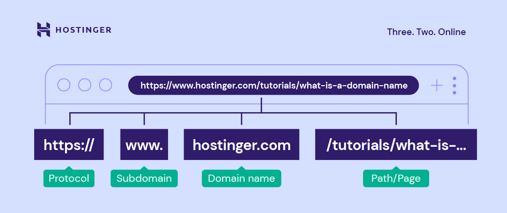
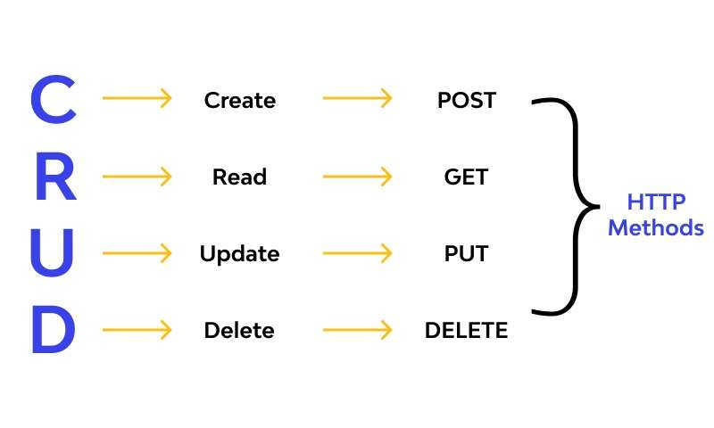
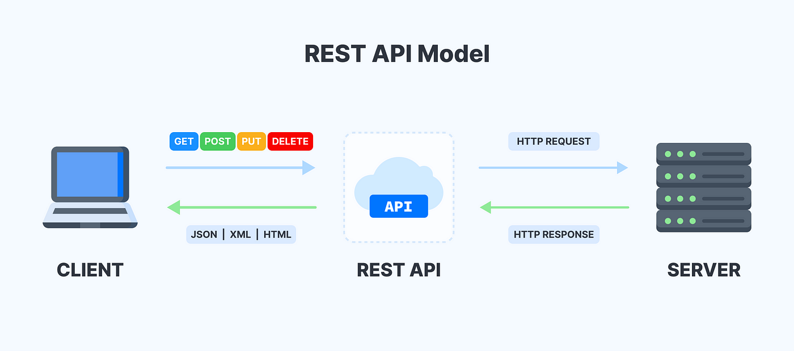

# Aula 1 - Introdução ao Desenvolvimento Web


## Fundamentos de Desenvolvimento Web
**Vamos ao que interessa!** A ideia é que ao final desta trilha possam ser capazes de desenvolver um site completo e funcional, com front-end, back-end, banco de dados e deploy. 

Aproveitando que já começamos com alguns termos, vocês já deveriam saber mas de qualquer maneira:

## O que é Front-End?

Basicamente, **Front-End** é a parte da aplicação com a qual o usuário interage diretamente. Ele é construído usando linguagens como HTML, CSS e JavaScript, podendo também utilizar frameworks como React — que veremos aqui.

## O que é Back-End?

Basicamente, **Back-End** é a parte da aplicação que roda “por trás das cortinas”, responsável por processar dados, aplicar regras de negócio, acessar bancos de dados e enviar as informações para o Front-End.

Ele é desenvolvido usando linguagens como JavaScript (Node.js), Python, Java, PHP, entre outras, e pode utilizar frameworks e bibliotecas como Express, Django ou Spring para agilizar o desenvolvimento.

O usuário não vê diretamente o Back-End, mas tudo o que ele faz na tela depende do que acontece nessa camada.

## Framework

É um conjunto de ferramentas e padrões que acelera o desenvolvimento (roteamento, templates, integrações). Diferente de uma biblioteca, **o framework “dirige” o fluxo e você “preenche os espaços”**.


---

### Agora que já sabem o básico do vocabulário podemos adentrar um pouco mais em desenvolvimento web propriamente dito e algumas de suas particularidades. 


## O que é desenvolvimento web?
Agora essa definição deve ficar mais clara para vocês:

Desenvolvimento web consiste em criar aplicações que rodam **no navegador (front-end)** e **em servidores (back-end)**, trocando dados pela internet via **protocolos** (regras de comunicação). O navegador faz **requisições** e o servidor responde com **conteúdo** (geralmente **HTML/CSS/JS** ou **JSON**).



---

## O que é um protocolo?

**Protocolo** é um conjunto de regras para dois lados se comunicarem. Na Web usamos uma pilha de protocolos:

* **HTTP/HTTPS** (aplicação): regras para pedir páginas/dados.
* **TLS** (segurança do HTTPS): criptografa a conversa.
* **TCP/IP** (transporte/rede): entrega os pacotes de dados.
* **DNS** (nomeação): traduz `meusite.com` para um IP.

Pense como um “idioma + etiqueta” que todos concordam em usar para se entender.

---

## HTTP e HTTPS

**HTTP** (HyperText Transfer Protocol) define como **requisições** e **respostas** são feitas. É **sem estado** (*stateless*): cada requisição é independente.
**HTTPS** = HTTP **+ TLS** (cadeado no navegador): a comunicação é **criptografada** e autenticada por **certificados digitais**.

### Anatomia de uma URL (Uniform Resource Locator)



## CRUD 

**CRUD** é um acrônimo para "Create, Read, Update, Delete" (Criar, Ler, Atualizar, Apagar), que descreve as quatro operações básicas de gerenciamento de dados em sistemas de armazenamento persistente, como bancos de dados. 

## Verbos (métodos) HTTP — mapeando para CRUD

| Verbo  | Uso comum                  | CRUD 
| ------ | -------------------------- | ---- 
| GET    | obter recurso              | R    
| POST   | criar recurso/ação         | C    
| PUT    | substituir recurso inteiro | U    
| PATCH  | atualizar parcial          | U    
| DELETE | remover recurso            | D    

---



### Exemplo de requisição e resposta HTTP (simplificado)

```
GET /api/posts HTTP/1.1
Host: exemplo.com
Accept: application/json

HTTP/1.1 200 OK
Content-Type: application/json

[{"id":1,"title":"Olá"},{"id":2,"title":"Web"}]
```

---

## Códigos de status

* **2xx** sucesso: **200 OK**, **201 Created**, **204 No Content**
* **3xx** redirecionamento: **301/302**
* **4xx** erro do cliente: **400 Bad Request**, **401 Unauthorized**, **403 Forbidden**, **404 Not Found**, **409 Conflict**, **422 Unprocessable Entity**, **429 Too Many Requests**
* **5xx** erro do servidor: **500 Internal Server Error**, **502/503**


---

## APIs, JSON e REST 

### O que é uma API?

API significa **Application Programming Interface** (*Interface de Programação de Aplicações*).
Em termos simples:

> É um “cardápio” de funcionalidades que um software oferece para que outro software possa usar.

Na web, falamos muito de **API HTTP** — ou seja, uma API acessível através de requisições HTTP, que podem ser feitas por:

* **Front-end** (ex.: um site em React consumindo dados do servidor)
* **Aplicativos mobile**
* **Outros sistemas** (integrações)

Uma API define:

1. **O que posso pedir** (endpoints, métodos, parâmetros)
2. **Como devo pedir** (métodos HTTP, headers, formato do corpo)
3. **O que recebo de volta** (formato e estrutura da resposta)

---

### O que é JSON?

**JSON** (*JavaScript Object Notation*) é o formato mais comum para trocar dados entre sistemas na web.

* É **texto puro**, fácil de ler e escrever.
* Estrutura parecida com objetos JavaScript: chaves `{}`, pares `chave: valor`, listas `[]`.
* Suporta tipos básicos: string, número, booleano, nulo, objeto e lista.

**Exemplo:**

```json
{
  "id": 1,
  "title": "Meu post",
  "published": true,
  "tags": ["react", "flask", "postgres"]
}
```

Por que usar JSON?

* É leve e fácil de transportar pela rede.
* É compreendido por praticamente todas as linguagens modernas.
* Conversão simples em Python (`json.loads` / `json.dumps`) e JS (`JSON.parse` / `JSON.stringify`).

---

### O que é REST?

**REST** (*Representational State Transfer*) é um **estilo de arquitetura** para APIs HTTP.
Não é uma tecnologia, mas sim um conjunto de princípios para organizar uma API de forma clara e padronizada.

**Princípios básicos:**

1. **Recursos são substantivos, não verbos**

   * `/users` → lista de usuários
   * `/posts/42` → post com id 42
2. **Métodos HTTP representam ações**

   * `GET /posts` → listar posts
   * `POST /posts` → criar post
   * `GET /posts/42` → obter post 42
   * `PUT /posts/42` → atualizar post 42
   * `PATCH /posts/42` → atualizar parte do post 42
   * `DELETE /posts/42` → apagar post 42
3. **Stateless** — cada requisição é independente; o servidor não guarda contexto entre elas (exceto em mecanismos explícitos como sessões).
4. **Formatos padronizados** — normalmente JSON, mas pode ser XML, CSV etc.
5. **Status codes HTTP** informam o resultado (200, 201, 404, 500, etc.).

---


### O que é uma API REST?

É uma **API HTTP** que segue os princípios REST:

* Usa métodos HTTP de forma semântica (`GET`, `POST`, etc.).
* Organiza URLs por recursos.
* Usa status codes adequados.
* É stateless.
* Usa formatos padronizados de resposta (geralmente JSON).

> **Exemplo de API REST (simplificada):**

```
GET /products          → lista todos os produtos
POST /products         → cria um novo produto
GET /products/10       → retorna produto com id 10
PUT /products/10       → substitui produto 10
PATCH /products/10     → altera parcialmente produto 10
DELETE /products/10    → remove produto 10
```

---

### E o que é FastAPI?

O **FastAPI** é um **framework Python para criar APIs**.

* Facilita a criação de APIs **REST** ou **GraphQL**.
* Faz **validação automática** dos dados de entrada com **type hints** do Python.
* Muito usado em APIs que precisam ser rápidas e seguras.


## Cookies, sessão e JWT

> Entre uma requisição e outra, temos diversos parâmetros que podem surgir, alguns deles abaixo:

* **Cookies**: pequenos dados salvos pelo navegador, podem carregar **tokens**.
* **Sessão**: o servidor guarda estado do usuário (ex.: logado).
* **JWT**: token assinado que o cliente envia no header `Authorization: Bearer <token>`. O servidor valida e autoriza sem guardar estado por usuário.

---


## O que é CORS (Cross-Origin Resource Sharing)?

Por padrão, os **navegadores** aplicam a **Same-Origin Policy** (*política de mesma origem*):

> Uma página só pode fazer requisições AJAX/fetch para o mesmo **origin** (mesmo protocolo, domínio e porta) de onde foi carregada.

**Exemplo:**

* Front hospedado em `http://localhost:5173`
* API hospedada em `http://localhost:5000`

Mesmo que ambos estejam no mesmo computador, **origens diferentes** → o navegador **bloqueia** a requisição por segurança.

---

### Onde entra o CORS?

O **CORS** é um mecanismo que permite ao servidor dizer ao navegador:

> “Essa origem X está autorizada a acessar meus recursos.”

Ele funciona adicionando **headers HTTP** especiais na resposta, como:

```
Access-Control-Allow-Origin: http://localhost:5173
Access-Control-Allow-Methods: GET, POST, PUT, DELETE
Access-Control-Allow-Headers: Content-Type, Authorization
```

---


### Em desenvolvimento

* É **normal** ter problemas de CORS quando o front e back rodam em portas diferentes.
* No Flask, resolvemos facilmente com a biblioteca `flask-cors`:

```python
from flask_cors import CORS
CORS(app, origins=["http://localhost:5173"])
```

---

## Dica
> Se algo “não abre”, confira **porta**, **URL** e **CORS**.

### Portas comuns

* **80** HTTP, **443** HTTPS
* **5173** Vite (front, dev)
* **5000** Flask (back, dev)
* **5432** PostgreSQL


---

## Mini-lab (10 minutos)

### Enviando requisições
Vamos testar algumas requisições para vermos como funciona. Abra 


  > **Windows**: use PowerShell.

  > **macOS/Linux**: terminal padrão.

1. **GET** simples (JSON):

```bash
Invoke-WebRequest -Uri "https://jsonplaceholder.typicode.com/posts/1"
```

2. **POST** com JSON:

```bash
Invoke-WebRequest -Uri "https://jsonplaceholder.typicode.com/posts" `
  -Method POST `
  -Body '{"title":"Meu Post","body":"Conteúdo","userId":1}' `
  -ContentType "application/json"
```

### Testando o Inspecionar

1. **Abra o Chrome** 
2. **Botão Direito → Inspecionar**
3. abra **Network** e recarregue a página. Veja **método**, **status**, **headers** e **response**.

---
