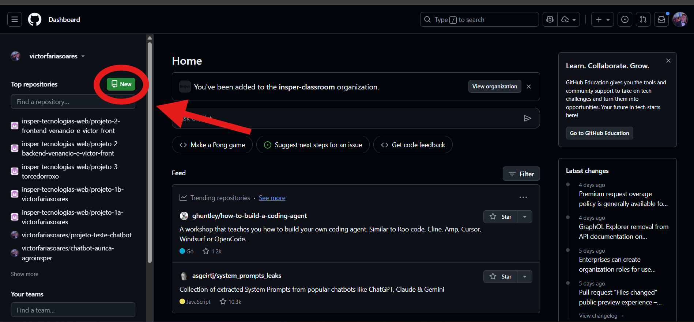
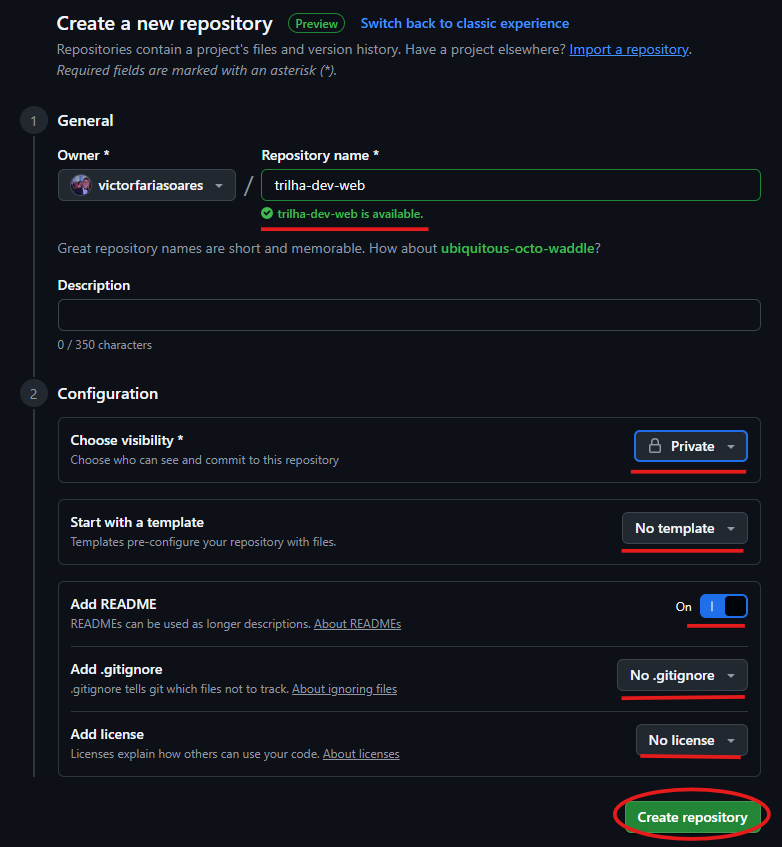
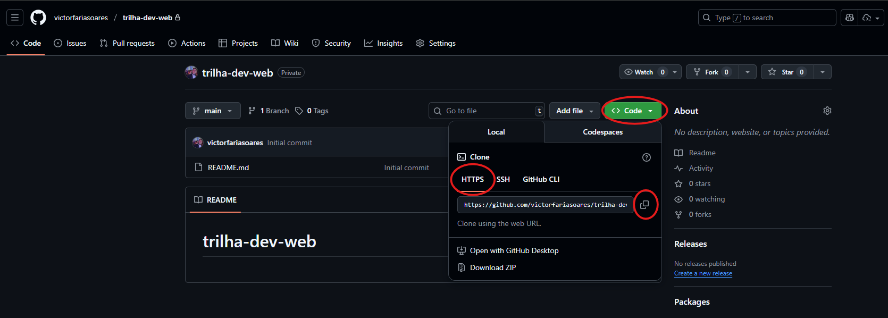
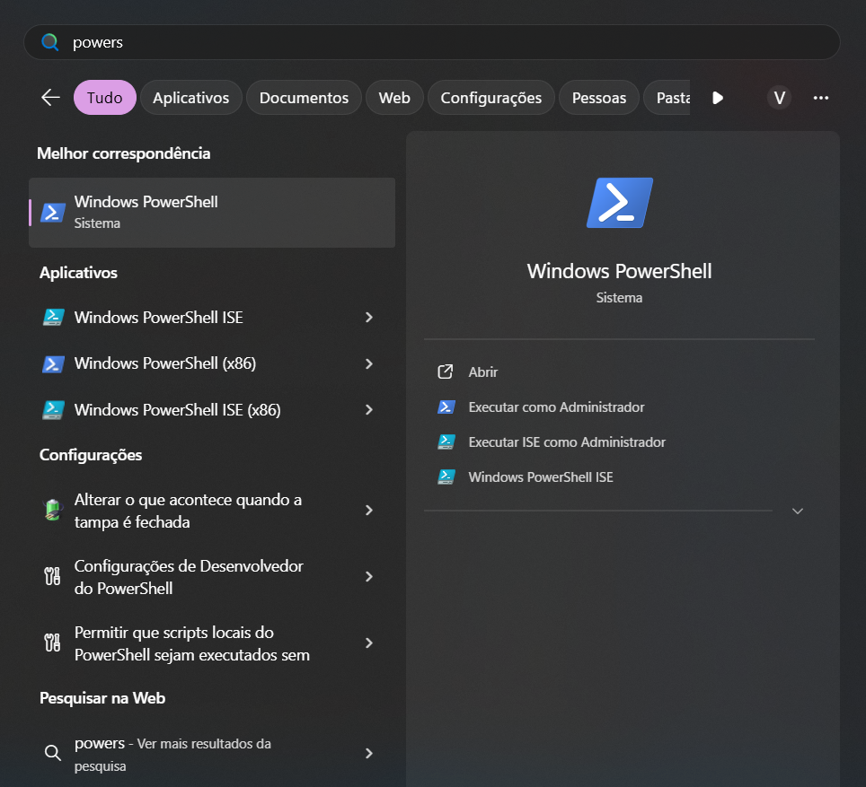
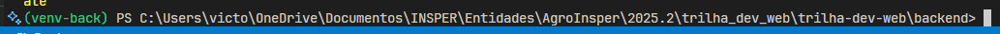
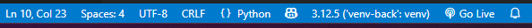
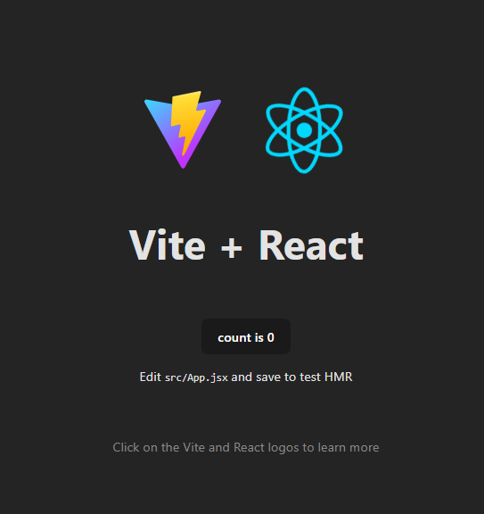
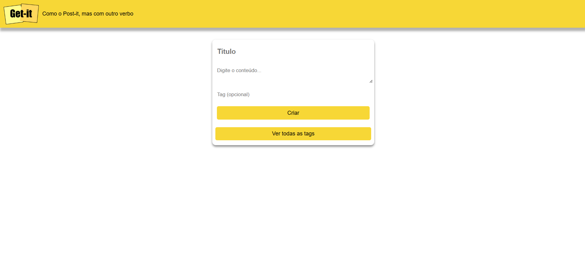

# Aula 2 — Ambiente de Desenvolvimento + Front-end (Parte 1)

> **Objetivo da aula:** Agora que ja entenderam o básico do desenvolvimento web, está na hora de prepararmos o ambiente de desenvolvimento de voês para construir um projeto full‑stack (git, venv, Node, estrutura de pastas) e construir o esqueleto do front-end em **React + Vite** com **roteamento**, **layout base** e **páginas iniciais**.


---

## 1) Organização do repositório (monorepo simples)

Por ser um projeto simples, usaremos um único repositório com duas pastas na raiz:

```
trilha-dev-web/
├─ frontend/   # React + Vite
└─ backend/    # Flask
```

  ## a. Criação do repositório no github
  Para começar, crie um repositório no github preferencialmente com o nome que preferir.  
  
  

  ## b. Clonar o repositório na sua máquina
  

  Abra um terminal powershell na sua máquina. É só pesquisar por PowerShell

  

  Com o terminal aberto e na pasta desejada, é só digitar `git clone [colar seu HTTPS]`, entrar na pasta e digitar `code .` para abrir o VS Code.

  Pronto, seu repositório está clonado em sua máquina!

  ## c. Crie um arquivo **.gitignore** na raiz para ignorar arquivos comuns a Node e Python:

Agora que temos o repositório criado, precisamos garantir que apenas os arquivos realmente importantes sejam enviados para o GitHub. Para isso usamos o .gitignore: um arquivo de configuração que indica ao Git quais arquivos e pastas devem ser ignorados no versionamento. Isso é essencial porque, durante o desenvolvimento, surgem muitos arquivos temporários ou específicos do ambiente local (como `node_modules`, `__pycache__` ou variáveis em `.env`(que veremos mais para frente)). Eles são necessários para rodar o projeto na sua máquina, mas não devem ir para o repositório.

  Caso esteja muito confuso, não se preocupe que com o tempo cada linha do gitignore fará sentido. 

  Crie um arquivo `.gitignore` na pasta raiz do seu repositório e adicione o conteúdo abaixo.

```gitignore
# --- Node ---
node_modules/
*.log
# Vite
frontend/dist/

# --- Python ---
.venv/
backend/venv-back
frontend/venv-front
__pycache__/
*.pyc
instance/
.env

# --- OS/Editor ---
.DS_Store
.vscode/
```
---

## 2) Preparando o ambiente de desenvolvimento

Antes de começar, precisamos falar sobre `ambientes virtuais (venv)`.

O venv é um recurso do Python que cria um ambiente virtual isolado para o seu projeto. Isso significa que cada aplicação pode ter suas próprias bibliotecas e versões de dependências, sem entrar em conflito com outros projetos na sua máquina. Imagine que em um projeto você precisa do Flask 2.x e em outro do Flask 3.x: com ambientes virtuais, isso é possível sem bagunça. Portanto,

  - Mantém as dependências organizadas por projeto.

  - Evita conflitos de versões entre diferentes aplicações.

  - Facilita a instalação e remoção de pacotes sem afetar o Python global da sua máquina.

Aqui nesta trilha e no projeto de vocês, vamos criar um ambiente virtual para o **back**, front não precisa.

### 2.1 Criar a venv

```bash
cd backend # entra na pasta do back
python -m venv venv-back
```
Isso ira criar uma pasta com o nome `venv-back`

<!-- Faça o mesmo para o front somente trocando `venv-back` → `venv-front` -->

### 2.2 Ativar a venv:
```bash
# Windows (PowerShell):
venv-back\Scripts\activate
```
```bash
# macOS/Linux:
source venv-back/bin/activate
```

Para saber se você ativou corretamente o ambiente virtual, ele deve aparecer no terminal escrito em verde. 


>OBS: Você deve abrir o VS Code somente depois de ativar a venv, pode digitar no mesmo terminal `code .` Ou também abrir o VS e pelo terminal dele ativar o ambiente virtual. Mas garanta que está trabalhando com a venv, que deve aparecer no canto inferior do seu VS.

Exemplo:



Caso não apareça, clique no botão que esta aparecendo o interpretador atual (terceiro da esquerda para a direita). E entre em 'Enter interpreter path'. Cole o caminho completo do seu ambiente, exemplo: 

`C:\Users\victo\OneDrive\Documentos\INSPER\Entidades\AgroInsper\2025.2\trilha_dev_web\trilha-dev-web\backend\venv-back\Scripts\python.exe`

### 2.3 requirements.txt

O arquivo `requirements.txt` é utilizado em projetos Python para listar todas as dependências (bibliotecas e suas versões) necessárias para o funcionamento do projeto. Com ele, é possível instalar facilmente todos os pacotes necessários usando o comando `pip install -r requirements.txt`. Isso facilita o compartilhamento e a reprodução do ambiente de desenvolvimento entre diferentes pessoas e máquinas.
Crie `backend/requirements.txt` com o mínimo necessário para começar:

```txt
Flask
python-dotenv
Flask-Cors
```

Instale:

```bash
pip install -r requirements.txt
```

> Se quiser ver quais pacotes e versões estão instalados neste ambiente, é só digitar:
```bash
pip list
```

> Para desativar o ambiente virtual:

```bash
deactivate
```

> Se eventualmente você baixar algum pacote "na mão" com o comando `pip install XXX` (o que é bem comum) e quiser colocar este novo pacote no requirements.txt, pode mandar o comando abaixo:

```bash
pip freeze > requirements.txt
```


---

## 3) Front-end: Vite + React

Com o ambiente pronto para o desenvolvimento vamos criar nosso frontend com **Vite + React**. É uma boa prática sempre olharem a documentação do framework para entender o que estão fazendo.

Para fins de curiosidade, os templates no Vite são configurações pré-definidas que ajudam a iniciar um projeto com uma tecnologia ou framework específico. Eles incluem a estrutura básica do projeto, arquivos de configuração e dependências necessárias para começar a trabalhar com o framework escolhido. 

Outros templates disponíveis no Vite incluem:

`vanilla`, `vue`, `svelte`, `lit`, `preact`, `solid` e `qwik`.

[Documentação Vite](https://vite.dev/guide/)


### 3.1 Criar projeto

```bash
cd frontend

npm create vite@latest . -- --template react
# Selecione: Framework - React e Variant: JavaScript

npm install
```


### 3.2 Testar funcionamento

Nesse ponto ja conseguimos abrir o projeto e ver se esta funcionando corretamente. Rode 

```bash
npm run dev
```

E o projeto deve abrir no http://localhost:5173/ e você deve encontrar a seguinte página:



## 4) Estrutura de pastas e arquivos do frontend

Depois de criar o projeto com Vite + React, sua pasta `frontend/` deve estar parecida com a descrita abaixo. Vamos entender para que serve cada parte:

- `node_modules/` → onde ficam todas as dependências instaladas com `npm install`. Você nunca altera nada aqui manualmente e essa pasta NUNCA deve ser commitada.

- `public/` → arquivos estáticos como imagens e ícones. Já vem com o `vite.svg` de exemplo.

- `src/`   → diretório principal do código fonte.

  - `assets/` → pasta para imagens, ícones e outros arquivos estáticos que você vai importar dentro do código React (vem com `react.svg`).

  - `App.jsx` → componente principal da aplicação React. Normalmente é o ponto inicial da UI.

  - `App.css` → estilos usados dentro do `App.jsx`.

  - `index.css` → estilos globais da aplicação, aplicados em todas as páginas.

  - `main.jsx` → arquivo de entrada da aplicação. Aqui o React inicializa e renderiza o `App` dentro da `div#root` do `index.html`.

- `.gitignore` → define o que será ignorado no versionamento do Git.

- `eslint.config.js` → configuração básica do ESLint (padrão do Vite).

- `index.html` → página HTML base. O Vite injeta seu JavaScript aqui no `div#root`.

- `package.json` → lista dependências, scripts e metadados do projeto.

- `package-lock.json` → arquivo gerado automaticamente, garante que todos usem as mesmas versões das dependências.

- `README.md` → instruções básicas do projeto (geradas pelo Vite).

- `vite.config.js` → configurações do Vite (pode ser alterado para plugins, aliases, etc.).

### 4.1 Fluxo resumido do React com Vite

Para entender melhor o que acontece quando rodamos `npm run dev`:

1. O Vite inicia um servidor de desenvolvimento e carrega o arquivo `index.html`.

2. Dentro do `index.html`, existe a tag `<div id="root"></div>` que será o ponto de montagem da aplicação React.

3. O `index.html` importa o `main.jsx`, que é o arquivo de entrada do projeto.

4. No `main.jsx`, o React cria a raiz (`ReactDOM.createRoot`) e renderiza o componente principal `App.jsx` dentro da `div#root`.

5. O `App.jsx` pode importar outros componentes, páginas, estilos (como `App.css`) e ir expandindo a interface.

6. Estilos globais são aplicados a partir do `index.css`.

Em resumo: `npm run dev` → Vite → `index.html` → `main.jsx` → `App.jsx` → seus componentes.

## 5) React Router

O React Router é a biblioteca que adiciona ao React a capacidade de ter múltiplas páginas (rotas).

```bash
npm install react-router-dom
```

## 6) Implementação de página básica

Vamos implementar uma página **Contact** com um formulário simples (nome, email, mensagem) e rota `/contact`. Ela poderá ser acessada da página **Home** através de um botão.

2. **Criar as rotas**

* `src/app/layout.jsx` aqui estamos criando um layout super básico que terá um botão **Home** e outro **Contact**.

```jsx
import { Outlet, NavLink } from "react-router-dom";

export default function Layout() {
    return (
        <div className="shell">
            <nav className="nav">
                <NavLink to="/" className="nav-link">Home</NavLink>
                <NavLink to="/contact" className="nav-link">Contact</NavLink>
            </nav>
            <main className="center"> {/*aqui entram os conteudos da página home e da página layout */}
                <Outlet /> 
            </main>
        </div>
    );
}


```

* `src/pages/Home.jsx` Aqui está sendo definido um componente funcional chamado Home. Ele retorna um elemento `<h1>` com o texto "Home". Este componente é usado para renderizar a página inicial.

```jsx
export default function Home() {
	return <h1>Home</h1>;
}
```

* `src/pages/Contact.jsx` Aqui esta sendo definido um componente funcional chamado Contact. Ele retorna um elemento `<form>` com campos para nome, email e mensagem. Este componente é usado para renderizar a página de contato.

```jsx
export default function Contact() {
    return (
        <form className="card">
            <input name="name" placeholder="Seu nome" />
            <input name="email" placeholder="Seu email" />
            <textarea name="message" placeholder="Mensagem" />
            <button type="submit">Enviar</button>
        </form>
    );
}

```

* `src/app/routes.jsx` Aqui estamos definindo as rotas da aplicação.

```jsx
import { createBrowserRouter } from "react-router-dom";
import Layout from "./layout";
import Home from "../pages/Home";
import Contact from "../pages/Contact";

export const router = createBrowserRouter([
	{
		path: "/",
		element: <Layout />,
		children: [
			{ index: true, element: <Home /> },
			{ path: "contact", element: <Contact /> },
			{ path: "*", element: <div>404 - Not Found</div> },
		],
	},
]);
```

3. Trocar o `main.jsx` para usar o Router. Aqui estamos importando o RouterProvider e passando o router criado anteriormente.

```jsx
import React from "react";
import ReactDOM from "react-dom/client";
import { RouterProvider } from "react-router-dom";
import { router } from "./app/routes";
import "./index.css";

ReactDOM.createRoot(document.getElementById("root")).render(
	<React.StrictMode>
		<RouterProvider router={router} />
	</React.StrictMode>
);
```

4. Adicionar todos os estilos em `index.css`

```css
/* Reset/estrutura base */
* { box-sizing: border-box; }
html, body, #root { height: 100%; }
body {
  margin: 0;
  font-family: system-ui, -apple-system, Segoe UI, Roboto, Helvetica, Arial, sans-serif;
  background: #1f1f1f;
  color: #f4f4f5;
}

/* Shell do app: nav em cima + conteúdo centralizado */
.shell {
  min-height: 100%;
  display: flex;
  flex-direction: column;
}

/* Navbar simples */
.nav {
  display: flex;
  gap: 12px;
  padding: 12px 16px;
}

/* Área central: centro exato da viewport */
.center {
  flex: 1;
  display: grid;
  place-items: center;   /* centraliza vertical e horizontal */
  padding: 24px;
}

/* Cartão genérico (útil pro formulário) */
.card {
  width: 320px;
  background: #f9f9f9;
  color: #18181b;
  padding: 24px;
  border-radius: 10px;
  box-shadow: 0 10px 30px rgba(0,0,0,.25);
}
.card input,
.card textarea,
.card button {
  width: 100%;
  padding: 10px 12px;
  border: 1px solid #d4d4d8;
  border-radius: 8px;
}
.card textarea { resize: vertical; min-height: 96px; }
.card button {
  cursor: pointer;
  border: none;
  margin-top: 8px;
  background: #111827;
  color: #fff;
  font-weight: 600;
}

.nav-link {
  padding: 8px 16px;
  border-radius: 6px;
  background: #27272a;
  color: #f4f4f5;
  text-decoration: none;
  font-weight: 500;
}

.nav-link:hover {
  background: #3f3f46;
}

.nav-link.active {
  background: #10b981;
  color: white;
}
```

5. **Rodar**

```bash
npm run dev
```

Acesse o `localhost:5173` e teste a navegação entre as páginas.

---

## Finalização

Bom, até aqui fizemos uma introdução extremamente simples sobre o react e com montar duas páginas e navegar entre elas através de botões. Para as próximas aulas vamos desenvolver um projeto um pouco mais robusto e interessante.

Para deixar a trilha mais divertida e prática, vamos implementar ao longo das aulas um app chamado **Get-it**, que funciona como um mural de post-its digitais. É exatamente o mesmo app usado na matéria **Tecnologias Web** do 4º Semestre de Engenharia de Computação. Nele, o usuário poderá:

- Criar um novo post-it (com título, conteúdo e uma tag).

- Editar post-its existentes.

- Deletar post-its.

- Visualizar todas as tags em uma página `/tags`.

- Clicar em uma tag e ver somente os post-its daquela tag `/tags/:slug`.

Isso vai nos permitir explorar bem o React no front, e depois relacionar entidades no banco de dados (um `post-it` pertence a uma `tag` → relação many-to-one).

Abaixo coloco uma foto do app para vocês irem se familiarizando:


