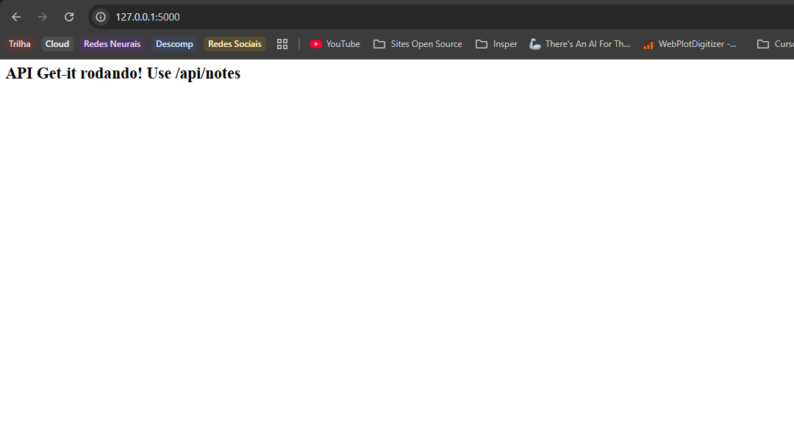
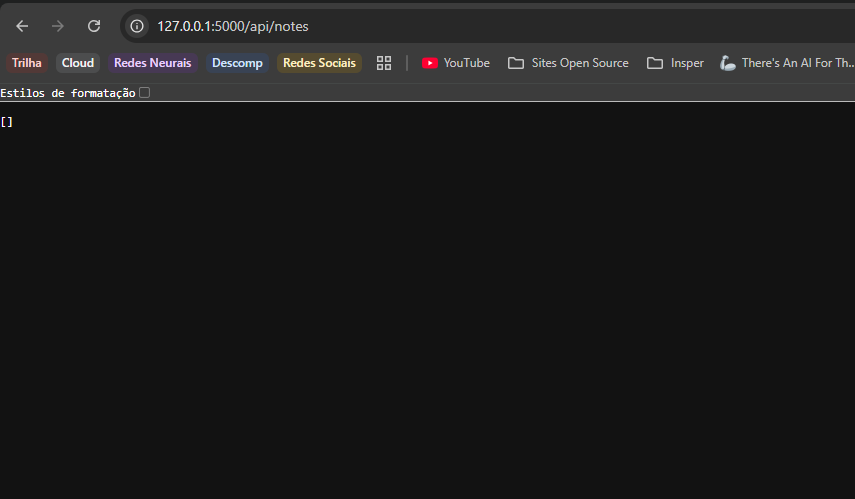
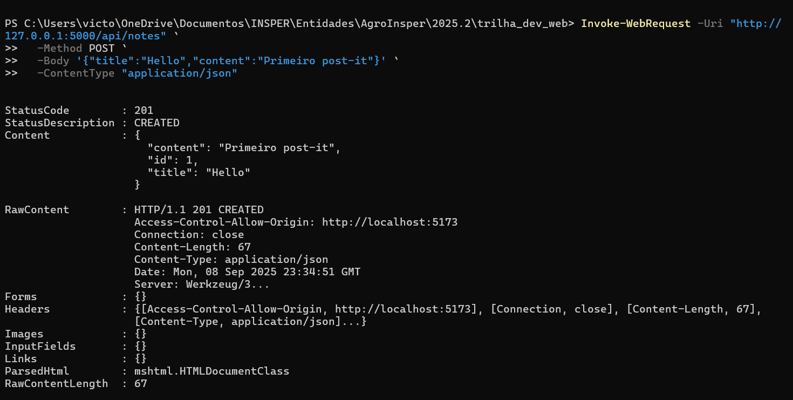
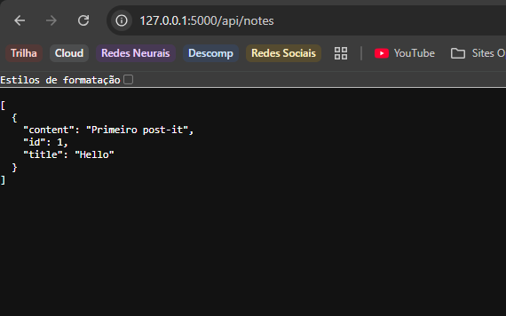
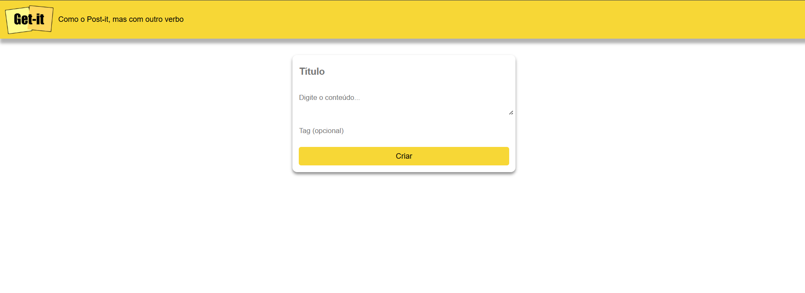

# Aula 3

Na última aula, preparamos o ambiente de desenvolvimento e criamos a estrutura básica do nosso projeto. Agora, vamos avançar para a implementação da interface principal, os **post-its**.

## Objetivos:

1. **Reproduzir a interface básica** mostrada na imagem (banner amarelo, formulário central e “post‑its” coloridos).
2. Construir **o caminho mínimo** front → back para:

   * **`GET /api/notes`** – listar post‑its existentes.
   * **`POST /api/notes`** – criar um novo post‑it.


---

# 1) Back‑end mínimo (Flask)

O primeiro passo é criar o back‑end mínimo que atenda aos dois endpoints.

> Já com a *venv* (`venv-back`) ativa.

```bash
cd backend
pip install flask flask-cors
```

Vamos criar um arquivo super simples somente para abrir o nosso back. Crie **`backend/app.py`**:

```python
from flask import Flask, request, jsonify
from flask_cors import CORS # segurança para não bloquear 

app = Flask(__name__) # Cria instância da aplicação
CORS(app, origins=["http://localhost:5173"]) # Autoriza apenas o origin do Vite

notes: list[dict] = []          # armazenamento em memória

@app.route("/") #Definindo a rota raiz, irá parecer quando rodar o flask
def index():
    return "<h2>API Get-it rodando! Use /api/notes</h2>"

@app.route("/api/notes", methods=["GET", "POST"]) # Definindo a rota /api/notes
def handle_notes():
    if request.method == "POST":
        data = request.get_json(force=True)
        note = { # Aqui vai pegar os campos basicos de um post-it e montar list (parsing de entrada)
            "id": len(notes) + 1,
            "title": data.get("title", "").strip(),
            "content": data.get("content", "").strip(),
        }
        notes.append(note)
        return jsonify(note), 201               # 201 Created
    return jsonify(notes)                       # Se for GET, retorna a lista de post-its

if __name__ == "__main__":
    app.run(debug=True)
```

Por enquanto neste código estamos rodando tudo localmente, sem banco de dados. Os post‑its ficam em memória na lista `notes`. Leia com calma cada parte do código para ver se consegue entender o que esta acontecendo.

## Abrindo o back‑end e testando a rota raiz

Com o primeiro arquivo pronto, vamos rodar o Flask:

*Rodar em um terminal separado*:

```bash
python app.py          # Flask na porta 5000
```

Você deve ver algo como:



Você pode ver que o que está escrito ai é exatamente o que escrevemos na função `index()`. 

## Testando o endpoint `/api/notes`

Agora, se você abrir o navegador em `http://localhost:5000/api/notes`, verá um array vazio (`[]`), que é o conteúdo inicial da nossa lista `notes`.



## Testando o POST

Deixe o Flask rodando e abra outro terminal. Vamos usar um comando direto no terminal para testar o POST:

```bash
# Windows PowerShell
Invoke-WebRequest -Uri "http://127.0.0.1:5000/api/notes" `
  -Method POST `
  -Body '{"title":"Hello","content":"Primeiro post‑it"}' `
  -ContentType "application/json"

# macOS/Linux
curl -X POST http://127.0.0.1:5000/api/notes \
  -H "Content-Type: application/json" \
  -d '{"title":"Hello","content":"Primeiro post‑it"}'
```

Você deverá ter a seguinte resposta no terminal:


Podemos ver que o `StatusCode` é `201`, que significa que o post‑it foi criado assim como definimos no `app.py`. Se você atualizar a página do navegador em `http://localhost:5000/api/notes`, verá o post‑it que acabou de criar:



---

# 2) Front‑end – React + Vite

Agora que temos o back‑end funcionando, vamos criar o front‑end igual ao da imagem do final da aula 2 que consome os dois endpoints.

## 2.1  Retirar todos os botões de `layout.jsx`

Antes, no arquivo de layout estávamos colocando os botões de **Home** e **Contact**. Agora, como não teremos mais essas páginas, podemos retirar esses botões. E deixar somente o `<Outlet />` que é onde o conteúdo da página vai ser renderizado. 

Além disso, já vamos importar um arquivo CSS que montaremos a seguir para deixar a página com a cara de post‑it.

Ele deve ficar assim:

```jsx
import { Outlet } from "react-router-dom";
import "../getit.css";

export default function Layout() {
    return (
        <div>
            <main>
                <Outlet />
            </main>
        </div>
    );
}
```

Esse jeito que estamos fazendo, de importar tudo no `layout.jsx`, é uma outra forma de fazer com que tenha alguns componentes em todas as páginas. 

A prática mais comum é criar componentes e importar eles sempre na página que estamos construindo.


## 2.2  `Home.jsx`

### Onde estávamos antes

Na **Aula 2**, a página `Home.jsx` era só um teste, com um texto simples:

```jsx
// src/pages/Home.jsx
export default function Home() {
  return <h1>Home</h1>;
}
```

Ou seja: a rota `/` apenas mostrava a palavra **Home** no navegador.
Agora vamos transformá-la no **mural de post-its** da aplicação.

---

## Imports necessários

Primeiro, vamos importar duas coisas do React e também o CSS que já preparamos:

```jsx
import { useEffect, useState } from "react";
import "../getit.css";
```

* **`useState`** → cria variáveis de estado (para guardar dados na memória do navegador).
* **`useEffect`** → executa um código automaticamente quando o componente é carregado.
* **`../getit.css`** → importa nosso estilo pronto, para que os elementos tenham a cara dos post-its.

Para entender melhor o que são `useState` e `useEffect`, veja a documentação oficial: [useEffect](https://react.dev/reference/react/useEffect) ;  [useState](https://react.dev/reference/react/useState).


## Estados iniciais

Depois declaramos os **estados** que a página precisa:

```jsx
const [notes, setNotes] = useState([]);
const [title, setTitle] = useState("");
const [content, setContent] = useState("");
const [tag, setTag] = useState("");
```

O que significa cada linha:

* **`notes`** → guarda a lista de post-its carregados do back-end.

  * **`setNotes`** → é a função que permite atualizar essa lista (por exemplo, quando criamos um novo post-it).

* **`title`** → guarda o texto digitado no campo de título do formulário.

  * **`setTitle`** → altera o valor de `title` sempre que o usuário digita algo no input.

* **`content`** → guarda o corpo do post-it.

  * **`setContent`** → atualiza esse conteúdo conforme o usuário digita no textarea.

* **`tag`** → guarda a tag opcional da nota.

  * **`setTag`** → altera o valor dessa tag.

>  **Por que precisamos do `setX`?**
> Em React, **não podemos mudar os estados diretamente** (ex: `title = "novo valor"`).
> O React controla quando deve redesenhar a tela, e isso só acontece se usamos a função `setX`.
> Assim, sempre que chamamos `setNotes`, `setTitle`, etc., o React sabe que precisa **re-renderizar o componente** para mostrar os novos valores na tela.


## Buscar dados no carregamento

Queremos que, quando a página abrir, o React busque as notas no back-end (`http://localhost:5000/api/notes`).
Isso é feito dentro de um **useEffect**:

```jsx
useEffect(() => {
  fetch("http://localhost:5000/api/notes")
    .then((r) => r.json())
    .then(setNotes);
}, []);
```

* O `[]` no final significa “rode apenas uma vez, quando a página carregar”.
* `fetch(...)` → faz a requisição HTTP para o Flask.
* `.then(setNotes)` → salva o resultado no estado `notes`.


## Função de criação de notas

Quando o usuário preencher o formulário e clicar em **Criar**, precisamos enviar a nota ao back-end.
Para isso, criamos a função `handleSubmit`:

```jsx
function handleSubmit(e) {
  e.preventDefault();
  fetch("http://localhost:5000/api/notes", {
    method: "POST",
    headers: { "Content-Type": "application/json" },
    body: JSON.stringify({ title, content, tag }),
  })
    .then((r) => r.json())
    .then((newNote) => {
      setNotes([...notes, newNote]); // adiciona na lista

      setTitle("");                  // limpa o formulário
      setContent("");
      setTag("");
    });
}
```

* `e.preventDefault()` → evita que a página recarregue.
* `method: "POST"` → cria a nota.
* `body: JSON.stringify(...)` → envia os dados no formato JSON.
* Ao receber a resposta, atualizamos a lista local e limpamos os campos.


## Estrutura do retorno (JSX)

Depois de definir estados e funções, precisamos dizer **o que aparece na tela**.
No React, isso é feito no **`return`**, onde escrevemos **JSX** — que parece HTML, mas tem algumas diferenças (como `className` no lugar de `class`). Esses campos estamos colocando nomes para que o CSS já estilize corretamente. Mas são nomes que você pode mudar se quiser.

```jsx
return (
  <>
    <div className="appbar">
      
      <p className="subtitle">Como o Post-it, mas com outro verbo</p>
    </div>

    <main className="container">
      <form className="form-card" onSubmit={handleSubmit}>
        <input
          className="form-card-title"
          placeholder="Título"
          value={title}
          onChange={(e) => setTitle(e.target.value)}
        />
        <textarea
          className="autoresize"
          placeholder="Digite o conteúdo..."
          value={content}
          onChange={(e) => setContent(e.target.value)}
        />
        <input
          className="form-card-tag"
          placeholder="Tag (opcional)"
          value={tag}
          onChange={(e) => setTag(e.target.value)}
        />
        <button className="btn-criar">Criar</button>
      </form>

      <ul className="card-container">
        {notes.map((note) => (
          <div className="card" key={note.id}>
            <h3 className="card-title">{note.title}</h3>
            <div className="card-content">
              <p>{note.content}</p>
              {note.tag && <p className="card-tag">#{note.tag}</p>}
            </div>
          </div>
        ))}
      </ul>
    </main>
  </>
);
```

---

## Linha por linha

#### 🔹 Cabeçalho (`appbar`)

```jsx
<div className="appbar">
  
  <p className="subtitle">Como o Post-it, mas com outro verbo</p>
</div>
```

* O bloco de cima é a **barra amarela** do app.
* Usa classes do nosso CSS (`appbar`, `logo`, `subtitle`).
* É fixo, não depende de dados.

---

#### 🔹 Formulário (`form-card`)

```jsx
<form className="form-card" onSubmit={handleSubmit}>
```

* Representa o **cartão branco central** onde o usuário digita a nota.
* Usa `onSubmit={handleSubmit}` para chamar a função de criação quando clicamos em **Criar**.

#### 🔹 Inputs controlados

```jsx
<input
  className="form-card-title"
  placeholder="Título"
  value={title}
  onChange={(e) => setTitle(e.target.value)}
/>
```

* Esse campo está **ligado ao estado `title`**.
* O valor vem de `title`.
* Sempre que o usuário digita, o `onChange` atualiza o estado com `setTitle(e.target.value)`.
* Isso se chama **componente controlado** → o React é quem manda no valor do input.

O mesmo acontece para:

* **Textarea** → ligado a `content` e `setContent`.
* **Input de tag** → ligado a `tag` e `setTag`.

#### 🔹 Botão Criar

```jsx
<button className="btn-criar">Criar</button>
```

* Dispara o `onSubmit` do formulário.
* Ganha estilo do CSS (`btn-criar` → botão amarelo).

---

#### 🔹 Lista de notas (`card-container`)

```jsx
<ul className="card-container">
  {notes.map((note) => (
    <div className="card" key={note.id}>
      <h3 className="card-title">{note.title}</h3>
      <div className="card-content">
        <p>{note.content}</p>
        {note.tag && <p className="card-tag">#{note.tag}</p>}
      </div>
    </div>
  ))}
</ul>
```

* Aqui mostramos todos os post-its que vieram do back-end.
* Usamos **`.map()`** para percorrer o array `notes`.
* Para cada nota:

  * Criamos um `<div className="card">` com título (`note.title`),
  * Conteúdo (`note.content`),
  * E a tag (se existir).

Repare:

1. **`key={note.id}`** → O React exige uma chave única em listas, para saber diferenciar os elementos.
2. **`{note.tag && ...}`** → Isso significa “só mostre a tag se ela existir”. É um **if curto** em JSX.

---

## Código completo final

Juntando tudo:

```jsx
// src/pages/Home.jsx
import { useEffect, useState } from "react";
import "../getit.css";

export default function Home() {
  const [notes, setNotes] = useState([]);
  const [title, setTitle] = useState("");
  const [content, setContent] = useState("");
  const [tag, setTag] = useState("");

  useEffect(() => {
    fetch("http://localhost:5000/api/notes")
      .then((r) => r.json())
      .then(setNotes);
  }, []);

  function handleSubmit(e) {
    e.preventDefault();
    fetch("http://localhost:5000/api/notes", {
      method: "POST",
      headers: { "Content-Type": "application/json" },
      body: JSON.stringify({ title, content, tag }),
    })
      .then((r) => r.json())
      .then((newNote) => {
        setNotes([...notes, newNote]);
        setTitle("");
        setContent("");
        setTag("");
      });
  }

  return (
    <>
      <div className="appbar">
        
        <p className="subtitle">Como o Post-it, mas com outro verbo</p>
      </div>

      <main className="container">
        <form className="form-card" onSubmit={handleSubmit}>
          <input
            className="form-card-title"
            placeholder="Título"
            value={title}
            onChange={(e) => setTitle(e.target.value)}
          />
          <textarea
            className="autoresize"
            placeholder="Digite o conteúdo..."
            value={content}
            onChange={(e) => setContent(e.target.value)}
          />
          <input
            className="form-card-tag"
            placeholder="Tag (opcional)"
            value={tag}
            onChange={(e) => setTag(e.target.value)}
          />
          <button className="btn-criar">Criar</button>
        </form>

        <ul className="card-container">
          {notes.map((note) => (
            <div className="card" key={note.id}>
              <h3 className="card-title">{note.title}</h3>
              <div className="card-content">
                <p>{note.content}</p>
                {note.tag && <p className="card-tag">#{note.tag}</p>}
              </div>
            </div>
          ))}
        </ul>
      </main>
    </>
  );
}
```

# 3) Estilização e logo

Agora crie o arquivo CSS que dará a cara de post‑it ao app com o nome **`src/getit.css`**.

```css
/*
Algumas informações úteis e dicas:
  - Fontes disponíveis:
    font-family: 'Roboto', sans-serif;
    font-family: 'Permanent Marker', cursive;
  - Cores:
    Tons de amarelo:
      #e4fc2b
      #e0d426
      #f7d736
      #e0af26
      #fcb02b
    Tons de cinza:
      #2c2c2c
      #4c4c4c
    Cores dos cards:
      #ead3a7
      #9de0f5
      #ef89ba
      #fae890
      #abe9c1
  - Sombra: https://codepen.io/sdthornton/pen/wBZdXq
 */

html,
body {
    font-family: "Roboto", sans-serif;
}

/* Você pode usar o CSS comentado abaixo, se ajudar */
/* Fonte: https://codepen.io/CrisWoler/pen/ogXBLj */

.logo{
    width: 6%;
    padding: .6%;
    justify-content: flex-start;
}

.appbar{
    background-color: #f7d736;
    display: flex;
    align-items: center;
    margin-bottom: 0;
    box-shadow: 0px 10px 6px rgba(0, 0, 0, 0.3);

}

.main{
    display: flex;
    align-items: center;
    justify-content: center;
}
.btn {
    position: relative;
    display: block;
    padding: 10px 15px;

    overflow: hidden;

    border-width: 0;
    outline: none;
    border-radius: 2px;
    box-shadow: 0 1px 4px rgba(0, 0, 0, 0.6);

    background-color: #f7d736;
    text-decoration-color: black;
    transition: background-color 0.3s;
}

.btn > * {
    position: relative;
}

.btn:before {
    content: "";
    position: absolute;
    top: 50%;
    left: 50%;
    display: block;
    width: 0;
    padding-top: 0;
    border-radius: 100%;
    background-color: rgba(236, 240, 241, 0.3);
    -webkit-transform: translate(-50%, -50%);
    -moz-transform: translate(-50%, -50%);
    -ms-transform: translate(-50%, -50%);
    -o-transform: translate(-50%, -50%);
    transform: translate(-50%, -50%);
}

.btn:active:before {
    width: 120%;
    padding-top: 120%;
    transition: width 0.2s ease-out, padding-top 0.2s ease-out;
} 

body, html {
    height: 100%;
    margin: 0;
    font-family: 'Roboto', sans-serif;
}

.container {
    display: flex;
    flex-direction: column;
    justify-content: center;
    align-items: center;
}

.form-card {
    position: relative;
    display: flex;
    overflow: hidden;
    border-width: 0;
    flex-direction: column;
    align-items: center;
    width: 26%;
    margin-top: 2%;
    margin-left: 30%;
    margin-right: 30%;
    padding: 14px;
    background-color: white;
    border-radius: 10px;
    box-shadow: 0px 4px 6px rgba(0, 0, 0, 0.441);
}

.form-card-title {
    width: 100%;
    margin-bottom: 15px;
    padding: 10px;
    font-size: 20px;
    border: none;
    border-radius: 5px;
    font-family: 'Roboto', sans-serif;
    font-weight: bold;
}

.autoresize{
    font-family: 'Roboto', sans-serif;
    font-size: 15px;
    width: 100%;
    margin-bottom: 15px;
    padding: 10px;
    border: none;
    border-radius: 5px;
}

.form-card-tag{
    font-family: 'Roboto', sans-serif;
    font-size: 15px;
    width: 100%;
    margin-bottom: 15px;
    padding: 10px;
    border: none;
    border-radius: 5px;
}

.btn-criar {
    padding: 10px 20px;
    font-size: 16px;
    color: black;
    background-color: #f7d736;
    border: none;
    border-radius: 5px;
    cursor: pointer;
    width: 100%;
}

.btn-tags {
    padding: 10px 5px;
    font-size: 16px;
    color: black;
    background-color: #f7d736;
    border: none;
    border-radius: 5px;
    cursor: pointer;
    width: 100%;
    text-align: center;
    text-decoration: none;
    margin-top: 5%;
}

.btn:hover {
    background-color: #a1b300;
}

.card-container {
    display: flex;
    flex-wrap: wrap;
    justify-content: center;
    margin-top: 30px;
}

.card {
    display: flex;
    flex-direction: column;
    width: 200px;
    background-color: #fff;
    margin: 10px;
    padding: 15px;
    border-radius: 10px;
    box-shadow: 0px 4px 6px rgba(0, 0, 0, 0.1);
    text-align: left;
    font-family: 'Permanent Marker', cursive;
}

.card-tag {
    font-style: italic;
    color: black; /* Cor do texto */
    background-color: #f7d736; /* Amarelo */
    border-radius: 5px; 
    font-weight: bold;
    width:fit-content;
    padding-left: 5%;
    padding-right: 5%;
}

.card-tag-link{
    text-decoration: none;
    color: black;
    
}

.card-content{
    color: #4c4c4c;
    padding-top: 10%;
    text-align: center;
}

.card-color-1{
    background-color:#ead3a7 ;
}
.card-color-2{
    background-color: #9de0f5 ;
}
.card-color-3{
    background-color:#ef89ba ;
}
.card-color-4{
    background-color:#fae890 ;
}
.card-color-5{
    background-color:#abe9c1 ;
}
.card-rotation-1{
    transform: rotate(1deg)
}
.card-rotation-2{
    transform: rotate(2deg)
}
.card-rotation-3{
    transform: rotate(3deg)
}
.card-rotation-4{
    transform: rotate(4deg)
}
.card-rotation-5{
    transform: rotate(-2deg)
}
.card-rotation-6{
    transform: rotate(-1deg)
}
.card-rotation-7{
    transform: rotate(-4deg)
}
.card-rotation-8{
    transform: rotate(6deg)
}
.card-rotation-9{
    transform: rotate(7deg)
}
.card-rotation-10{
    transform: rotate(4deg)
}
.a {
    width:30px;
}

.card-title {
    font-size: 18px;
    margin-bottom: 10px;
}

.card-content {
    font-size: 14px;
}

.botoes{
    display: flex;
    flex-direction: row-reverse;
}

.lixeira{
    text-decoration: none;
}

.edit{
    text-decoration: none;
}
```

## Logo

Adicione esta foto com o nome `logo-getit.png` para a logo do app:


---

# 4) Ajustando as rotas para exibir a Home

Até agora criamos a página `Home.jsx`, mas se não conectarmos ela no **roteador**, o navegador não vai saber qual componente mostrar.


### 1. `routes.jsx`

Agora precisamos ligar a URL `/` com a página `Home.jsx`.

```jsx
// src/app/routes.jsx
import { createBrowserRouter } from "react-router-dom";
import Layout from "./layout";
import Home from "../pages/Home";

export const router = createBrowserRouter([
  {
    path: "/",
    element: <Layout />,
    children: [
      { path: "/", element: <Home /> },   // aqui chamamos a Home
    ],
  },
]);
```

Explicando:

* Importamos `Home` (a página que montamos agora).
* Dentro do array de `children`, adicionamos a rota `{ path: "/", element: <Home /> }`.
* Isso significa: quando o usuário abrir `http://localhost:5173/`, o React Router vai mostrar o conteúdo de `Home` dentro do `Outlet` do `Layout`.


# 5) Acabamos!?

Vamos somente o front para ver se está tudo de acordo.

Em um terminal:

```bash
cd frontend
npm run dev
```

Ué, temos algum erro. Não? A página não está exatamente com a cara que queríamos. De cara podemos notar dois problemas:

1. O fundo da tela está preto e deveria estar branco.
2. A escrita "Como o Post-it, mas com outro verbo" está em branco mas deveria estar em preto.
---


**Para resolver o primeiro problema, pense, mexemos em todos os arquivos necessários?** 

Você já deve imaginar que a resposta é: não. Esquecemos de um arquivo que também esta dentro do nosso fluxo, o arquivo `main.jsx`.

Entrando nele percebemos que não importamos o CSS que criamos. Vamos importar ele lá.

Troque `import "./index.css";` por `import "../getit.css";`.


Pronto! Foi melhor do que pensávamos. Resolvemos os dois problemas de uma vez só. Agora sua página deve estar assim:




**AGORA SIM! Estamos prontos para rodar tudo.**
# 6) Vamos agora rodar os dois juntos 


Em **terminal 1**:

```bash
cd backend
python app.py
```

Em **terminal 2**:

```bash
cd frontend
npm run dev                 # http://localhost:5173
```

Abra o navegador em `localhost:5173`, crie alguns post‑its… e veja surgirem!

---

# 7) Esquecemos de mais uma coisa

Vocês devem ter percebido que quando criamos os post-its eles estão com a mesma cor. Vamos resolver isso no `home.jsx`.

O que está acontecendo é que estamos renderizando todos os post-its com a mesma classe `card`.

A ideia para corrigir isso é criar uma função que retorne uma cor diferente para cada post-it. Como temos 5 cores, podemos usar o número de post-its para definir a cor.

Vamos trocar todo o `<ul className="card-container">` por:

```jsx
<ul className="card-container">
  {notes.map((note, i) => {
    const colorClass = `card-color-${(i % 5) + 1}`;
    return (
      <div className={`card ${colorClass}`} key={note.id}>
        <h3 className="card-title">{note.title}</h3>
        <div className="card-content">
          <p>{note.content}</p>
          {note.tag && <p className="card-tag">#{note.tag}</p>}
        </div>
      </div>
    );
  })}
</ul>
```

# 8) Vamos entender o que está acontecendo

Agora que conseguimos adicionar alguns post-its, precisamos entender o que está acontecendo em cada página. 

No nosso front, em `localhost:5173`, temos nossos post-its com a função de criar novos post-its funcionando. Você deve ter notado que a funcionalidade de Tags, mesmo se inserida no formulário, não aparece na tela. Isso acontece pois no nosso back-end, em `app.py`, só criamos os campos `id`, `title` e `content`. Iremos arrumar isso depois.

Para visualizarmos os post-its que criamos, precisamos olhar o terminal onde o Flask está rodando. Lá podemos ver os logs de requisições que estão sendo feitas e se entrarmos em `http://127.0.0.1:5000` no navegador, podemos ver os post-its que criamos em formato JSON.

Então podemos concluir que o front está se comunicando com o back, e o back está armazenando os post-its em memória!

Perfeito 👌 vamos montar a continuação da **Aula 3**, agora explicando passo a passo como implementar a **deleção de um post-it**.

---

# 9) Deletando Post-its

Até agora nossa página **Home.jsx** já permite **criar** post-its e listá-los na tela.
Agora vamos dar o próximo passo: **deletar** uma nota existente.


## Como será nosso fluxo?

1. Criar uma função para deletar uma nota. Essa função deverá enviar uma requisição **DELETE** para o back-end. 
2. Mostrar um botão para deletar cada post-it. Quando o usuário clicar, nesse botão, chamaremos a função de deletar. 
4. Atualizar a lista local (`notes`) para remover o item da tela.

---

## Alterando o front-end

### Criando a função `handleDelete`

Dentro de **Home.jsx**, logo após a função `handleSubmit`, adicione:

```jsx
function handleDelete(id) {
  fetch(`http://localhost:5000/api/notes/${id}`, {
    method: "DELETE",
  }).then(() => {
    // remove da lista local
    setNotes(notes.filter((n) => n.id !== id));
  });
}
```

* Fazemos um `fetch` com `method: "DELETE"`.
* Se o back-end confirmar, usamos `setNotes` para atualizar a lista, **sem precisar recarregar a página**.
* O método `.filter()` do JavaScript cria um novo array apenas com os elementos que satisfazem a condição passada, ou seja, todos os post-its cujo `id` é diferente do que foi deletado.

---

### Adicionando o botão de lixeira

Dentro do `return` que renderiza os cards,  vamos adicionar um `<a href/>` com o o botão da lixeira ja incluindo a função de deletar que criamos acima:

```jsx
<a href="#" className="lixeira" onClick={(e) => { e.preventDefault(); handleDelete(note.id); }}>🗑️</a>
```

* Usamos a classe `lixeira` que já existe no CSS.
* O evento `onClick={() => handleDelete(note.id)}` chama a função de exclusão passando o id da nota.

---

## Alterando o back-end para suportar DELETE

No **app.py**, adicionamos a rota **DELETE**:

```python
@app.route("/api/notes/<int:note_id>", methods=["DELETE"])
def delete_note(note_id):
    global notes
    notes = [n for n in notes if n["id"] != note_id]
    return "", 204
```

* Recebe o `note_id` da URL.
* Remove a nota correspondente da lista `notes`.
* Retorna `204` (No Content), indicando que a exclusão foi bem-sucedida.

Agora, teste!

---

# 10) Conclusão

Pronto! Agora já temos um CRUD parcial: **Create** e **Delete**.
Na próxima aula, vamos implementar o **Editar** (Update) e explorar a página de **edição**.


