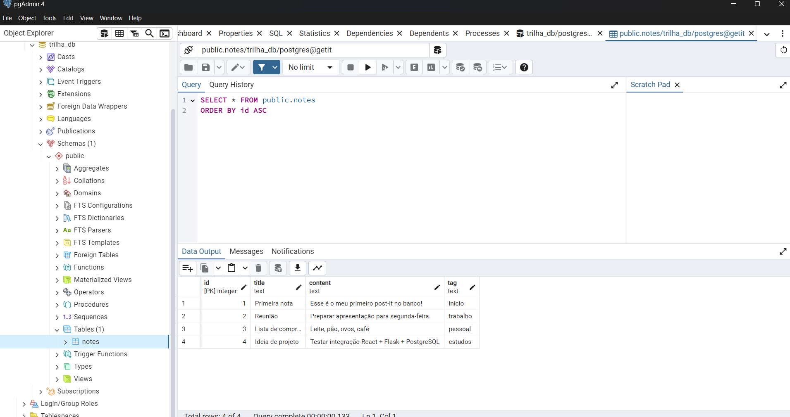

# Aula 4

Até a aula passada, estávamos guardando os post-its apenas em memória, dentro de uma lista Python (`notes`) algo extremamente simples.
Agora é hora de usar um **banco de dados de verdade** para que os dados fiquem **persistentes**, ou seja, não desapareçam quando o servidor reiniciar.

## Objetivos

Os nossos objetivos nesta aula estão centralizados em implementar toda a estrutura necessária para usar um banco de dados PostgreSQL com Flask, e também adicionar mais uma funcionalidade, a de **Editar** um post-it já existente.

1. Instalar e configurar **PostgreSQL** e **pgAdmin**.
2. Conectar o back-end Flask ao banco usando **psycopg2**.
3. Criar tabela `notes` e migrar os endpoints (`GET`, `POST`, `DELETE`).
4. Implementar o **Editar (Update)** com rota `PUT /api/notes/<id>`.
5. Criar a página de edição no front-end (`EditNote.jsx`).

---


# 1) Instalando PostgreSQL + pgAdmin

Até agora trabalhamos com dados em **memória** (lista Python), mas isso não é suficiente para uma aplicação real.
Por isso, vamos usar o **PostgreSQL**, um dos bancos de dados relacionais mais usados no mundo.

Mas além do **servidor PostgreSQL** (onde os dados ficam armazenados de fato), também vamos instalar o **pgAdmin**.

---

## O que é o pgAdmin?

O **pgAdmin** é uma ferramenta gráfica oficial para gerenciar o PostgreSQL.
Ele funciona como um **painel de controle visual** para o banco de dados:

* Permite **criar bancos e tabelas** sem precisar decorar comandos SQL.
* Facilita a **execução de queries** (SELECT, INSERT, UPDATE, DELETE) com um editor embutido.
* Exibe os dados em **tabelas visuais**, o que ajuda a entender melhor o que está acontecendo.
* Permite **monitorar conexões e desempenho**.

O pgAdmin não é a única forma de gerenciar PostgreSQL. Alguns exemplos populares:

* **psql** → Cliente oficial em linha de comando. Vem instalado junto com o PostgreSQL.
* **DBeaver** → Ferramenta gráfica universal (funciona com PostgreSQL, MySQL, Oracle, SQLite e muitos outros).
* **TablePlus** → Interface paga (mas tem versão gratuita limitada), bem moderna e leve.
* **DataGrip** → IDE profissional da JetBrains, suporta vários bancos (PostgreSQL, MySQL, MongoDB etc.).
* **HeidiSQL / Beekeeper Studio** → Outras opções conhecidas para gerenciar bancos SQL.

> Aqui vamos usar o **pgAdmin** porque é gratuito, oficial e suficiente para o nosso projeto.
> Mas em projetos profissionais você pode acabar usando **DBeaver** ou **DataGrip**, que são mais completos.


### Windows

Baixe o instalador em https://www.pgadmin.org/ 

E [aqui](https://www.youtube.com/watch?v=gEgRSS3Z8JQ) tem um vídeo da própria matéria de TecWeb mostrando o passo a passo.

Crie com a senha `admin` (anote essa senha, você vai precisar dela para entrar no pgAdmin).

### macOS

```bash
brew install postgresql
brew services start postgresql
```


### Linux (Ubuntu/Debian)

```bash
sudo apt update
sudo apt install postgresql postgresql-contrib
sudo systemctl start postgresql
sudo systemctl enable postgresql
```

---

# 2) Criando banco e tabela

## 2.1 Abra o **pgAdmin**

## 2.2 Clique com botão direito em Databases → Create → Database.

**Nome**: trilha_db

**Dono**: postgres.

**Salvar**.

## 2.3 Criar tabela `notes`

Abra a aba **Query Tool** clicando com o botão direito em `trilha_db` → Query Tool.

Rode o seguinte código SQL:

```sql
-- Se a tabela já existir, apaga para recriar do zero
DROP TABLE IF EXISTS notes;

-- Criação da tabela principal de post-its
CREATE TABLE notes (
    id SERIAL PRIMARY KEY,      -- id auto-incremental
    title TEXT NOT NULL,        -- título obrigatório
    content TEXT NOT NULL,      -- conteúdo obrigatório
    tag TEXT                    -- tag opcional
);

-- Inserindo alguns registros iniciais de exemplo
INSERT INTO notes (title, content, tag) VALUES
('Primeira nota', 'Esse é o meu primeiro post-it no banco!', 'inicio'),
('Reunião', 'Preparar apresentação para segunda-feira.', 'trabalho'),
('Lista de compras', 'Leite, pão, ovos, café', 'pessoal'),
('Ideia de projeto', 'Testar integração React + Flask + PostgreSQL', 'estudos');

```

Agora temos uma tabela `notes` pronta para receber nossos dados.

Para termos de curiosidade, abaixo estão os principais tipos de dados de string em SQL.


## 2.4 Verificando se a tabela foi criada

Após isso, vá em Tables, clique com o botão direito e de um Refresh.

Agora clique com o botão direito em `notes` → View/Edit Data → All Rows.

Você deve ver os 4 post-its que acabamos de inserir.



# 3) Configurando Flask com psycopg2

No **venv do backend**, instale:

```bash
pip install psycopg2-binary
```

Edite o `backend/app.py`:

```python
from flask import Flask, request, jsonify
from flask_cors import CORS
import psycopg2

app = Flask(__name__)
CORS(app, origins=["http://localhost:5173"])

# Conexão com o banco (ajuste usuário/senha conforme sua instalação)
conn = psycopg2.connect(
    dbname="trilha_db",
    user="postgres",
    password="admin",
    host="localhost",
    port="5432"
)
conn.autocommit = True

@app.route("/")
def index():
    return "<h2>API Get-it rodando com PostgreSQL!</h2>"

@app.route("/api/notes", methods=["GET", "POST"])
def handle_notes():
    cur = conn.cursor()
    if request.method == "POST":
        data = request.get_json(force=True)
        cur.execute(
            "INSERT INTO notes (title, content, tag) VALUES (%s, %s, %s) RETURNING id, title, content, tag",
            (data.get("title", "").strip(), data.get("content", "").strip(), data.get("tag", "").strip())
        )
        new_note = cur.fetchone()
        cur.close()
        return jsonify({"id": new_note[0], "title": new_note[1], "content": new_note[2], "tag": new_note[3]}), 201

    # Se for GET
    cur.execute("SELECT id, title, content, tag FROM notes ORDER BY id")
    notes = cur.fetchall()
    cur.close()
    return jsonify([
        {"id": n[0], "title": n[1], "content": n[2], "tag": n[3]}
        for n in notes
    ])

@app.route("/api/notes/<int:note_id>", methods=["DELETE"])
def delete_note(note_id):
    cur = conn.cursor()
    cur.execute("DELETE FROM notes WHERE id = %s", (note_id,))
    cur.close()
    return "", 204

if __name__ == "__main__":
    app.run(debug=True)

```

---

# 4) Testando

1. Rode o back e o front:

```bash
# com a venv-back ativa
cd backend
python app.py
```

```bash
cd frontend
npm run dev
```

2. Veja que os post-its iniciais aparecem.


Tente adicionar e deletar um post-it pela interface web e veja que ele aparece no banco de dados (pgAdmin).

# 5) Entendendo o que fizemos no `app.py`


## O que mudou do `app.py` da Aula 3 para a Aula 4?

Na Aula 3, nosso back-end usava apenas uma **lista em memória (`notes`)** para armazenar os post-its.
Agora, na Aula 4, fizemos a **migração para o PostgreSQL** usando a biblioteca **psycopg2**.

As principais mudanças foram:

---

### 🔹 1. Importamos o psycopg2

```python
import psycopg2
```

* Antes não havia conexão com banco.
* Agora usamos o **psycopg2** para abrir uma conexão real com o PostgreSQL.

---

### 🔹 2. Criamos a conexão com o banco

```python
conn = psycopg2.connect(
    dbname="getit",
    user="postgres",
    password="sua_senha_aqui",
    host="localhost",
    port="5432"
)
conn.autocommit = True
```

* Antes: os dados ficavam apenas na lista Python `notes`.
* Agora: conectamos no banco `getit` e usamos **autocommit** para gravar alterações direto no banco.

---

### 🔹 3. Alteramos a rota inicial

```python
return "<h2>API Get-it rodando com PostgreSQL!</h2>"
```

* Só mudamos a mensagem para indicar que agora estamos rodando com **PostgreSQL**.

---

### 🔹 4. Rota `/api/notes` — de lista Python para tabela do banco

Antes (Aula 3):

```python
notes: list[dict] = []

if request.method == "POST":
    note = {
        "id": len(notes) + 1,
        "title": data.get("title", "").strip(),
        "content": data.get("content", "").strip(),
    }
    notes.append(note)
    return jsonify(note), 201
```

Agora (Aula 4):

```python
if request.method == "POST":
    cur.execute(
        "INSERT INTO notes (title, content, tag) VALUES (%s, %s, %s) RETURNING id, title, content, tag",
        (data.get("title", "").strip(), data.get("content", "").strip(), data.get("tag", "").strip())
    )
    new_note = cur.fetchone()
    return jsonify({"id": new_note[0], "title": new_note[1], "content": new_note[2], "tag": new_note[3]}), 201
```

* **Antes:** cada post-it era adicionado numa lista local (`notes`).
* **Agora:** o post-it é salvo na tabela `notes` no PostgreSQL.
* **SELECT no GET:** em vez de devolver a lista Python, buscamos os dados do banco (`SELECT id, title, content, tag FROM notes`).

---

### 🔹 5. Rota DELETE

Antes (Aula 3):

```python
notes = [n for n in notes if n["id"] != note_id]
```

Agora (Aula 4):

```python
cur.execute("DELETE FROM notes WHERE id = %s", (note_id,))
```

* **Antes:** apagávamos apenas da lista em memória.
* **Agora:** deletamos diretamente do banco PostgreSQL.


---

# 6) Implementando o Editar (Update)

## Back-end (Flask)

No `app.py`, adicione (logo depois das outras rotas):

```python
# Buscar uma nota específica
@app.route("/api/notes/<int:note_id>", methods=["GET"])
def get_note(note_id):
    cur = conn.cursor()
    cur.execute(
        "SELECT id, title, content, tag FROM notes WHERE id = %s",
        (note_id,)
    )
    note = cur.fetchone()
    cur.close()
    if note:
        return jsonify({"id": note[0], "title": note[1], "content": note[2], "tag": note[3]})
    return jsonify({"error": "Note not found"}), 404
```

E também o `PUT` para editar:

```python
@app.route("/api/notes/<int:note_id>", methods=["PUT"])
def update_note(note_id):
    data = request.get_json(force=True)
    cur = conn.cursor()
    cur.execute(
        "UPDATE notes SET title=%s, content=%s, tag=%s WHERE id=%s RETURNING id, title, content, tag",
        (data.get("title", "").strip(), data.get("content", "").strip(), data.get("tag", "").strip(), note_id)
    )
    updated = cur.fetchone()
    cur.close()
    if updated:
        return jsonify({"id": updated[0], "title": updated[1], "content": updated[2], "tag": updated[3]})
    return jsonify({"error": "Note not found"}), 404
```

---

## Front-end — Página de edição

Crie **`src/pages/EditNote.jsx`**:

```jsx
import { useEffect, useState } from "react";
import { useParams, useNavigate } from "react-router-dom";

export default function EditNote() {
  const { id } = useParams();
  const navigate = useNavigate();
  const [title, setTitle] = useState("");
  const [content, setContent] = useState("");
  const [tag, setTag] = useState("");

  // Buscar nota existente pelo id
  useEffect(() => {
    fetch(`http://localhost:5000/api/notes/${id}`)
      .then((r) => r.json())
      .then((note) => {
        if (note.error) {
          alert("Nota não encontrada!");
          navigate("/");
        } else {
          setTitle(note.title);
          setContent(note.content);
          setTag(note.tag || "");
        }
      });
  }, [id, navigate]);

  function handleUpdate(e) {
    e.preventDefault();
    fetch(`http://localhost:5000/api/notes/${id}`, {
      method: "PUT",
      headers: { "Content-Type": "application/json" },
      body: JSON.stringify({ title, content, tag }),
    })
      .then((r) => r.json())
      .then(() => navigate("/"));
  }

  return (
    <main className="container">
      <form className="form-card" onSubmit={handleUpdate}>
        <input
          className="form-card-title"
          value={title}
          onChange={(e) => setTitle(e.target.value)}
        />
        <textarea
          className="autoresize"
          value={content}
          onChange={(e) => setContent(e.target.value)}
        />
        <input
          className="form-card-tag"
          value={tag}
          onChange={(e) => setTag(e.target.value)}
        />
        <button className="btn-criar">Salvar</button>
      </form>
    </main>
  );
}
```

---

## Ajustando rotas

No **`routes.jsx`**, adicione a rota de edição:

```jsx
import EditNote from "../pages/EditNote";

export const router = createBrowserRouter([
  {
    path: "/",
    element: <Layout />,
    children: [
      { path: "/", element: <Home /> },
      { path: "/edit/:id", element: <EditNote /> },
    ],
  },
]);
```

---

## Botão de edição

No **`Home.jsx`**, dentro do `map`, adicione o botão de edição junto da lixeira:

```jsx
<div className="botoes">
  <a href={`/edit/${note.id}`} className="edit">✏️</a>
  <a href="#" className="lixeira" onClick={(e) => { e.preventDefault(); handleDelete(note.id); }}>🗑️</a>
</div>
```

---
Agora cada post-it terá **botão de editar** e **botão de deletar**.

O nosso fluxo ficou assim:

* `GET /api/notes` → lista todas as notas.
* `GET /api/notes/<id>` → busca só uma nota.
* `PUT /api/notes/<id>` → edita uma nota.
* O front consome diretamente o endpoint correto sem baixar dados desnecessários.

# 8) Correção de notas 

Por enquanto, ao tentar criar ou editar uma nota, não há validação se o título ou conteúdo estão vazios.
Até colocamos no SQL que esses campos são `NOT NULL`, mas se tentarmos enviar uma nota sem conteúdo ou título, ela vai ser adicionada normalmente pois fica como string vazia `""` o que é diferente de `NULL`.

## Editando o `app.py`:

Adicione este campo logo depois de `data = request.get_json(force=True)` e antes de `cur.execute(...)` no `GET\POST` e `PUT`:

```python
if not data.get("title", "").strip() or not data.get("content", "").strip():
            cur.close()
            return jsonify({"error": "Título e conteúdo são obrigatórios"}), 400
```

## Atualizando o front `Home.jsx`:

```jsx
	function handleSubmit(e) {
		e.preventDefault();
		
		if (!title.trim() || !content.trim()) {
			alert("Título e conteúdo são obrigatórios!");
			return;
		}
		fetch("http://localhost:5000/api/notes", {
			method: "POST",
			headers: { "Content-Type": "application/json" },
			body: JSON.stringify({ title, content, tag }),
		})
			.then(async (r) => {
				if (r.status === 201) {
					const newNote = await r.json();
					setNotes([...notes, newNote]); // só adiciona se o back realmente criou
					setTitle("");
					setContent("");
					setTag("");
				} else if (r.status === 400) {
					const error = await r.json();
					alert(error.error);
				}
			});
	}
```

## Atualizando o `EditNote.jsx`:

Mesma coisa que fizemos em `Home.jsx`, na função `handleUpdate`:

```jsx
function handleUpdate(e) {
  e.preventDefault();

  // 🔎 Validação no front: impedir edição vazia
  if (!title.trim() || !content.trim()) {
    alert("Título e conteúdo são obrigatórios!");
    return;
  }

  fetch(`http://localhost:5000/api/notes/${id}`, {
    method: "PUT",
    headers: { "Content-Type": "application/json" },
    body: JSON.stringify({ title, content, tag }),
  })
    .then(async (r) => {
      if (r.status === 200) {
        await r.json();
        navigate("/");
      } else if (r.status === 400) {
        const error = await r.json();
        alert(error.error);
      }
    });
}

```

---

Boa! 🚀 Se vamos aproveitar a **Aula 4** para já implementar as **tags**, conseguimos fechar esse ciclo:

* **Salvar tags** junto com as notas.
* **Listar todas as tags existentes**.
* **Permitir clicar em uma tag e ver só as notas daquela tag**.

Vou montar o conteúdo em **Markdown** já no estilo das outras aulas.

---

# 9) Trabalhando com Tags

Até agora, nossas notas já tinham um campo `tag`, mas ele ainda não estava sendo usado de forma completa.
Agora vamos implementar mas sem CSS:

1. **Endpoint para listar todas as tags existentes.**
2. **Página `/tags` para mostrar a lista de tags.**
3. **Página `/tags/:tag` para mostrar todas as notas de uma tag específica.**
4. **Links nas notas para navegar por tag.**

---

## 1. Back-end (Flask)

### a) Listar todas as tags

No `app.py`, adicione:

```python
# Listar todas as tags únicas
@app.route("/api/tags", methods=["GET"])
def list_tags():
    cur = conn.cursor()
    cur.execute("SELECT DISTINCT tag FROM notes WHERE tag IS NOT NULL AND tag <> '' ORDER BY tag")
    tags = [row[0] for row in cur.fetchall()]
    cur.close()
    return jsonify(tags)
```


---

### b) Listar notas de uma tag específica

Ainda no `app.py`, adicione:

```python
# Listar todas as notas de uma tag específica
@app.route("/api/tags/<tag_name>", methods=["GET"])
def notes_by_tag(tag_name):
    cur = conn.cursor()
    cur.execute(
        "SELECT id, title, content, tag FROM notes WHERE tag = %s ORDER BY id",
        (tag_name,)
    )
    notes = cur.fetchall()
    cur.close()
    return jsonify([
        {"id": n[0], "title": n[1], "content": n[2], "tag": n[3]}
        for n in notes
    ])
```

---

## 2. Front-end — Página de Tags

Crie **`src/pages/Tags.jsx`**:

```jsx
import { useEffect, useState } from "react";
import { Link } from "react-router-dom";

export default function Tags() {
  const [tags, setTags] = useState([]);

  useEffect(() => {
    fetch("http://localhost:5000/api/tags")
      .then((r) => r.json())
      .then(setTags);
  }, []);

  return (
    <main className="container">
      <h2>Todas as tags</h2>
      <ul>
        {tags.map((t, i) => (
          <li key={i}>
            <Link to={`/tags/${t}`} className="card-tag-link">#{t}</Link>
          </li>
        ))}
      </ul>
    </main>
  );
}
```

---

## 3. Front-end — Página de Notas por Tag

Crie **`src/pages/NotesByTag.jsx`**:

```jsx
import { useEffect, useState } from "react";
import { useParams, Link } from "react-router-dom";

export default function NotesByTag() {
  const { tag } = useParams();
  const [notes, setNotes] = useState([]);

  useEffect(() => {
    fetch(`http://localhost:5000/api/tags/${tag}`)
      .then((r) => r.json())
      .then(setNotes);
  }, [tag]);

  return (
    <main className="container">
      <h2>Notas com a tag: #{tag}</h2>
      <ul className="card-container">
        {notes.map((note) => (
          <div className="card" key={note.id}>
            <h3 className="card-title">{note.title}</h3>
            <div className="card-content">
              <p>{note.content}</p>
              {note.tag && (
                <Link to={`/tags/${note.tag}`} className="card-tag">
                  #{note.tag}
                </Link>
              )}
            </div>
          </div>
        ))}
      </ul>
    </main>
  );
}
```

---

## 4. Ajustando rotas

No **`routes.jsx`**, adicione as duas páginas novas:

```jsx
import Tags from "../pages/Tags";
import NotesByTag from "../pages/NotesByTag";

export const router = createBrowserRouter([
  {
    path: "/",
    element: <Layout />,
    children: [
      { path: "/", element: <Home /> },
      { path: "/edit/:id", element: <EditNote /> },
      { path: "/tags", element: <Tags /> },
      { path: "/tags/:tag", element: <NotesByTag /> },
    ],
  },
]);
```

---

## 5. Linkando tags nas notas

No **`Home.jsx`**, ajuste a parte que renderiza a tag para ficar clicável:

```jsx
{note.tag && (
  <a href={`/tags/${note.tag}`} className="card-tag-link">#{note.tag}</a>
)}
```

---

## 6. Resultado:

1. Criar notas com tags.
2. Ir para `/tags` → lista de todas as tags únicas.
3. Clicar em uma tag → `/tags/:tag` → mostra só as notas daquela tag.
4. Tags nas notas da Home também são links clicáveis.

---

# 10) Conclusão

Agora temos o CRUD completo e adicionamos a funcionalidad de **tags** para organizar as notas.

Até aqui, já implementamos:

* **Create** → Criar notas
* **Read** → Listar notas (todas ou por tag)
* **Update** → Editar notas
* **Delete** → Apagar notas
* **Tags** → Organizar e filtrar notas


