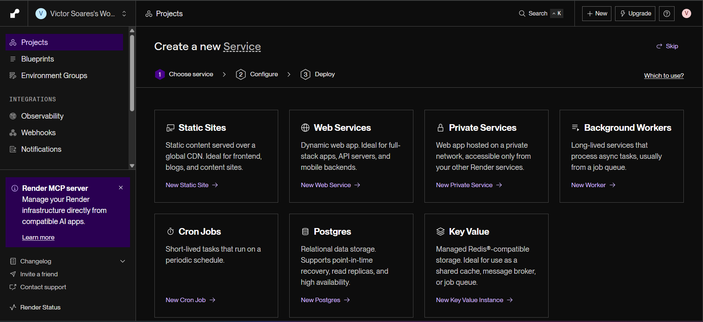
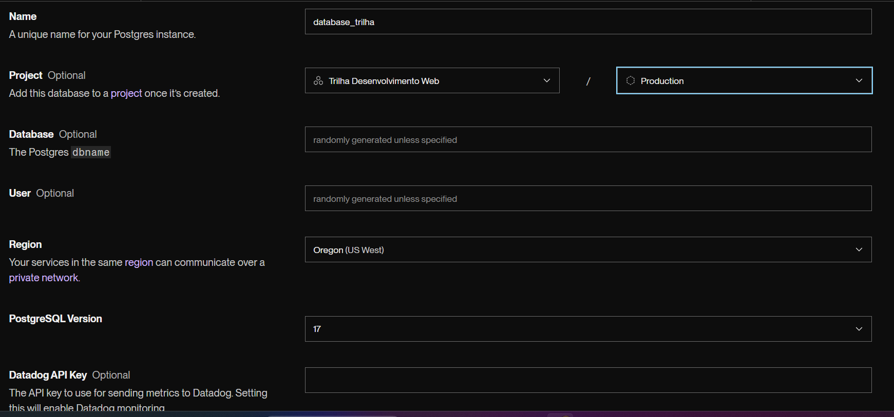
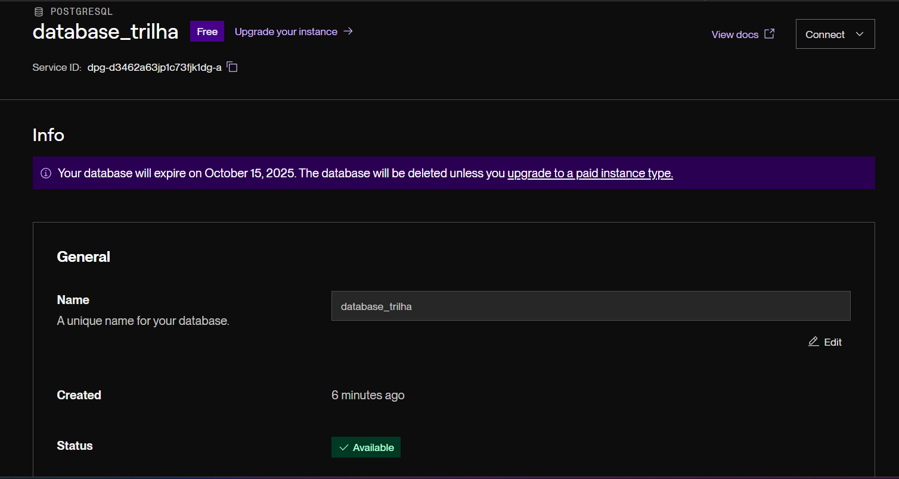
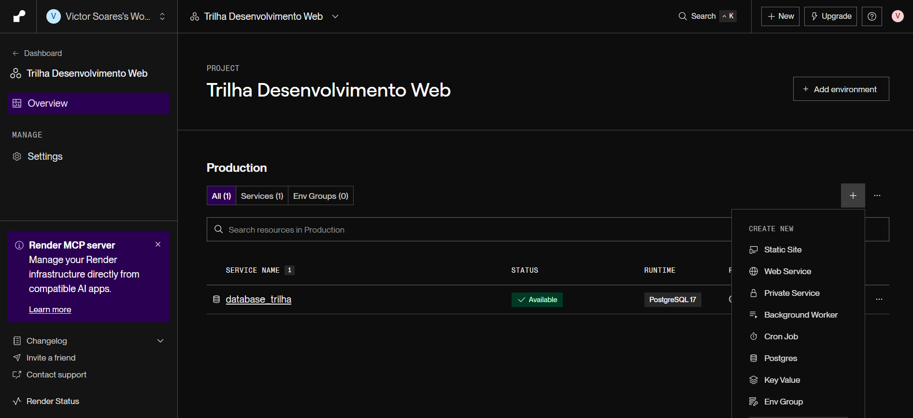
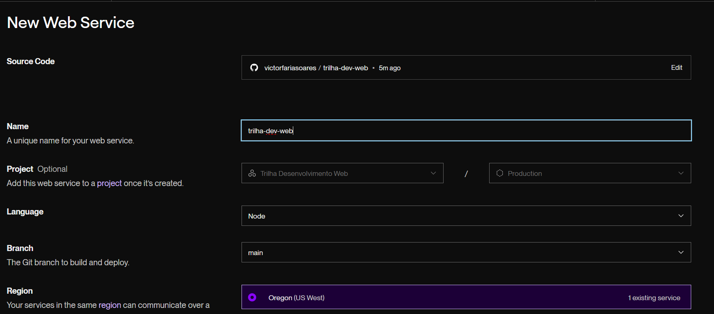
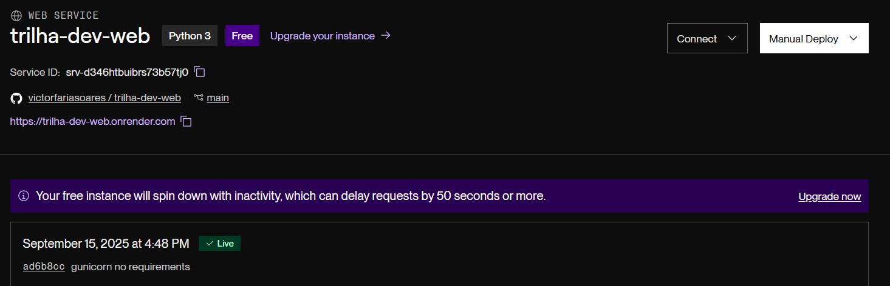

# Aula 5 — Deploy do Projeto Full-Stack

Chegamos na última etapa da trilha!
Até agora, construímos um projeto **completo** com **React + Vite** no front, **Flask + PostgreSQL** no back e fizemos todo o CRUD (Create, Read, Update, Delete) com suporte a **tags**.

Agora vamos dar o passo final: **colocar o projeto no ar** para que qualquer pessoa possa acessar.

---

## Objetivos da Aula

1. Hospedar o **back-end Flask + Banco de Dados PostgreSQL** em uma plataforma de cloud gratuita.
2. Hospedar o **front-end React (Vite)** em uma plataforma de deploy estático.
3. Configurar **variáveis de ambiente** (sem expor senhas).
4. Ajustar **CORS e URLs** para que front e back se comuniquem mesmo hospedados em domínios diferentes.

---

# 1) Hospedando o Back-end (PostgreSQL + Flask)

Existem várias opções de hospedagem gratuita para back-ends Python:

* [Render](https://render.com/)
* [Railway](https://railway.app/)
* [Fly.io](https://fly.io/)

Aqui vamos usar o **Render**, que é simples e tem plano gratuito.

---

## 1.1 Banco de Dados PostgreSQL no Render

1. Acesse [https://render.com](https://render.com).
2. Crie sua conta (de preferência logar com GitHub). Ao entrar você deverá encontrar uma tela como esta:



3. Vá em **Postgres** e selecione essas opções. Eu criei um projeto para organizar melhor os serviços mas não é obrigatório:


4. Selecione o plano **Free** e em seguida clique em **Create Database**. Você verá uma tela como esta:




É o **External Database URL** que você vai usar no DATABASE_URL do backend, copie ela.

5. No seu projeto, dentro da pasta backend/, abra o arquivo .env e coloque a URL no DATABASE_URL. 

## 1.2 Backend no Render

Antes de começar o deploy, precisamos adicionar no requirements.txt o gunicorn, que é o servidor de produção para aplicações Python.

```bash 
pip install gunicorn
pip freeze > requirements.txt
# Commite essas mudanças
```

1. Volte para a tela inicial do Render, entre no projeto → `+` → **Web Services**.



2. Selecione o repositório do GitHub onde está o seu projeto (você tem que ter tudo commitado). Caso não apareça, clique em **Credentials** e autorize o acesso ao repositório. Você verá uma tela como esta:



### Configurações do Web Service (Render)

**Source Code**

* Selecione o repositório `trilha-dev-web`.

**Name**

* `trilha-dev-web` (ou outro nome amigável).

**Project**

* Opcional (pode colocar “Trilha Desenvolvimento Web” para organizar).

**Language**

* `Python`.

**Branch**

* `main` (ou o branch que você usa no GitHub).

**Root Directory**

* `backend`

**Build Command**

```bash
pip install -r requirements.txt
```

**Start Command**

```bash
gunicorn "app:create_app()"
```

**Environment Variables**
Clique em **+ Add Environment Variable** e adicione:

* `DATABASE_URL` → cole a **External Database URL** do Postgres criado no Render.
* `SECRET_KEY` → pode colocar a mesma que já tinhamos.

**Advanced**

* **Health Check Path** → pode deixar vazio (ou `/`).
* **Pre-Deploy Command** → deixe vazio (a não ser que queira rodar migrations aqui).
* **Auto-Deploy** → `On Commit` (para atualizar sempre que você fizer `git push`).

**Build Filters**

* Deixe vazio.

Depois clique em **Deploy Web Service** 


3. Aguarde o deploy (pode levar alguns minutos). Se tudo der certo, você verá uma tela como esta:



Tente entrar na url fornecida no `/api/notes` para ver se está funcionando. Provavelmente estará retornando erro 500, pois o banco de dados ainda não foi inicializado.

Vá no terminal do back e rode:

```bash
flask db upgrade
```

Espere alguns segundos e atualize a página. Agora deve funcionar, você verá um `[]` (lista vazia)!


# 2) Hospedando o Front-end (React + Vite)


### **1. Ajustar o front para usar o back remoto**

1. Na pasta `frontend/`, crie um arquivo **`.env`**:

   ```env
   VITE_API_URL=<URL DO SEU BACK>
   ```

2. No código React, garanta que todos os `fetch` estão usando a variável de ambiente.
   Exemplo no `Home.jsx`:

   ```js
   useEffect(() => {
     fetch(`${import.meta.env.VITE_API_URL}/api/notes`)
       .then((r) => r.json())
       .then(setNotes);
   }, []);
   ```

   E no `handleSubmit`:

   ```js
   fetch(`${import.meta.env.VITE_API_URL}/api/notes`, {
     method: "POST",
     headers: { "Content-Type": "application/json" },
     body: JSON.stringify({ title, content, tag }),
   })
   ```

   > Isso garante que, no Vercel, o front vai falar direto com o back no Render. Cuidado com os que são `/api/tag`.

---

### **2. Subir para GitHub**

1. `git add .`
2. `git commit -m "prepara frontend para deploy"`
3. `git push origin main`

---

### **3. Criar o projeto no Vercel**

1. Vá em [https://vercel.com](https://vercel.com).
2. Crie sua conta (ou logue com GitHub).
3. Clique em **New Project** → selecione o repositório `trilha-dev-web`.
4. Nas configurações:

   * **Root Directory** → `frontend`
   * **Framework Preset** → Vite
   * **Build Command** → `npm run build`
   * **Output Directory** → `dist`
   * **Install Command**: deixe vazio
   * **Environment Variables**: Colocar o do backend

        Name: `VITE_API_URL`

        Value: `https://trilha-dev-web.onrender.com`

---


### **4. Deploy**

1. Clique em **Deploy**.
2. O Vercel vai rodar o build (`npm install`, `npm run build`) e depois disponibilizar seu site.
3. Você vai ganhar uma URL pública, algo como:

   ```
   https://trilha-dev-web.vercel.app/
   ```

---

### **5. Ajustar CORS no back**

No `app/__init__.py`, troque:

```python
CORS(app, origins=["http://localhost:5173"])
```

por:

```python
CORS(app, origins=[
    "http://localhost:5173",            # Dev local
    "https://trilha-dev-web.vercel.app" # Produção no Vercel
])
```

Depois faça commit e push → o Render vai redeployar sozinho.

---

### **6. Testar**

1. Abra a URL do Vercel no navegador.
2. Crie, edite e delete notas.
3. Verifique no Render Database se os dados estão realmente indo para o Postgres remoto.


# 3). Corrigindo erro 404 nas rotas do Vercel

Se você tentar acessar alguma tag, editar um post-it ou acessar diretamente uma rota do seu site no Vercel (por exemplo `/edit/8` ou `/tags/trabalho`), pode aparecer o erro:

```
404: NOT_FOUND
```

Isso acontece porque o **Vercel tenta procurar um arquivo físico naquela rota** (ex.: `tags/trabalho/index.html`), mas como estamos usando **React Router** (Single Page Application), todas as rotas precisam ser redirecionadas para o `index.html`.

### Como resolver

Precisamos criar um arquivo de configuração chamado **`vercel.json`** dentro da pasta `frontend/`:

```
trilha-dev-web/
├─ backend/     # Flask (Render)
├─ frontend/    # React (Vercel)
│   ├─ src/
│   ├─ package.json
│   ├─ index.html
│   └─ vercel.json   ✅ aqui!
```

Conteúdo do arquivo `frontend/vercel.json`:

```json
{
  "rewrites": [
    { "source": "/(.*)", "destination": "/" }
  ]
}
```

Esse arquivo diz ao Vercel:

> “Independente da rota acessada, sempre entregue o `index.html`. O React Router cuida de mostrar a página correta.”

### Passos finais

1. Crie o arquivo `vercel.json` na pasta `frontend/`.
2. Faça commit e push para o GitHub:

   ```bash
   git add frontend/vercel.json
   git commit -m "fix: SPA routes config for Vercel"
   git push origin main
   ```
3. O Vercel fará um novo deploy automaticamente.
4. Agora, rotas como `/edit/8` ou `/tags/trabalho` vão funcionar normalmente sem dar 404.

---


# 4) Conclusão

Parabéns!
Agora vocês têm um projeto **full-stack completo**:

* **React + Vite (front-end)** hospedado no **Vercel**.
* **Flask + PostgreSQL (back-end)** hospedado no **Render**.
* **CRUD completo com tags** funcionando em produção.

Esse é exatamente o fluxo que vocês usariam em um projeto real

